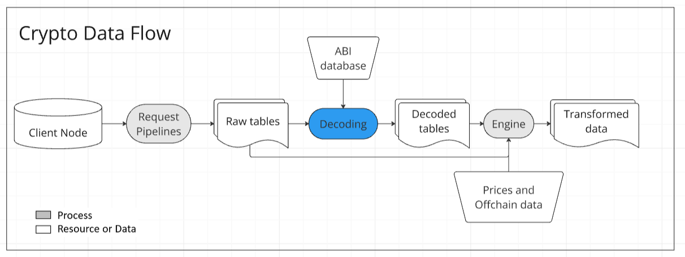
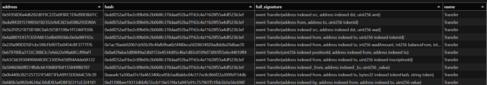
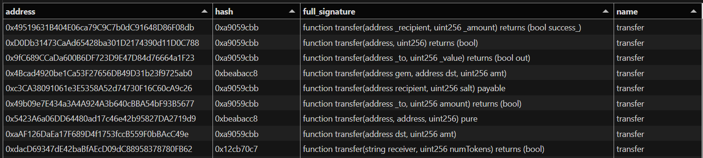
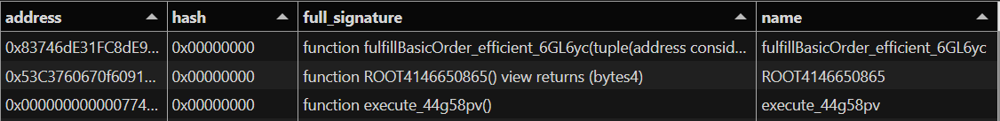

# Key Concepts of Decoding

Decoding is the process of converting raw transaction data and logs from smart contracts into a human-readable format. By leveraging the contract’s [ABI](https://docs.soliditylang.org/en/latest/abi-spec.html) (Application Binary Interface), we can map out function and parameter names, making the data interpretable. This transformation is essential to provide critical context—clarifying the meaning of each field or value—and ensuring that proper type casting occurs during the decoding process.

## Why Decoding is Necessary

Smart contracts on the blockchain are stored as low-level opcodes, which are a series of instructions that the Ethereum Virtual Machine (EVM) executes. However, these opcodes are not the same as the high-level programming language (such as Solidity) in which the contracts were originally written. While Solidity compiles down into opcodes, nodes interacting with the blockchain only have access to the opcodes themselves and are unaware of the original Solidity code. As a result, they lack essential information like function names, parameter names, types, and the interpretation of outputs. Decoding is, therefore, necessary to make sense of raw contract data.

## Core Concepts of Decoding

Decoding involves translating the raw log data into a human-readable format, complete with function and parameter names. This process relies on the contract ABI, which serves as a translation guide for understanding the data structure. 

Basic decoding is supported by libraries such as **[alloy-rs](https://github.com/alloy-rs)**, **[ethers.js](https://github.com/ethers-io/ethers.js)**, and **[web3.py](https://github.com/ethereum/web3.py)**, commonly used to help developers interact with the Ethereum Virtual Machine (EVM). These libraries offer methods that allow users to input a contract ABI and a raw log, and then output a decoded version of the log. This approach works well for logs originating from well-known contract sources, where the ABI perfectly matches the contract code. However, processing data at scale introduces several challenges.

Large-scale decoding requires users to maintain an extensive ABI database. Since ABIs cannot be directly retrieved from the blockchain, they are typically sourced from off-chain providers like Etherscan, where contracts are submitted for transparency and auditability.  However, it’s unlikely that we will have access to every contract code or ABI.

Decoding logs from contracts for which the code or ABI is unknown is still possible. This is because contracts often reuse code from other contracts, meaning functions and events frequently share the same signature (name and parameters). In such cases, the ABI of another contract can be used to decode the logs.

## Key Components of Decoding

Let’s break down the key components of decoding:

- **ABI (Application Binary Interface)**: The ABI is a JSON file that defines the structure of the functions and events in a smart contract. It includes information about function names, parameters, return types, and indexed fields. This file acts as the guide for decoding raw contract logs.
- **ABI Item**: The ABI information for each function and event.
- **Full Signature**: This includes all the details of a function or event, such as its name, parameter types, and whether any parameters are indexed. It provides the complete context needed for accurate decoding.
- **Signature**: A simplified version of the full signature. It consists of the function or event name and the parameter types but does not include parameter names or indexing details.
- **Indexed Params**: Params from events can be indexed. This means it will be stored in topics (topic1-3), allowing them to be more easily queried and filtered by the node. Non-indexed parameters are stored in the data field.
- **Hash**: The Keccak (SHA3) hash of the signature (not the full signature).
    - Events are identified by the 32-byte Keccak hash (SHA3) of their signature, which is stored in the logs tree as topic0.
    - Function calls in the EVM are identified by the first four bytes of the data sent with a transaction. These 4 bytes signatures are derived from the first four bytes of the Keccak hash (SHA3) of the function signature.

Here are some examples of the `Transfer` event and the `transfer` function:

## Decoding Methods

With these concepts in mind, we can implement two methods for decoding data at scale:

1. Exact **ABI** match**:** This method, pioneered by Dune, involves users providing the ABI either manually or by downloading it from Etherscan using the contract's address. Events and function calls are decoded using only an exact match of the ABI, ensuring accuracy. However, this method depends on having a comprehensive set of contract submissions to ensure broad coverage.

2. **Algorithmic Decoding:** This method uses algorithms to match onchain information about the logs and signature hashes (topic0, 4-byte) with any available ABI. It is particularly useful for analytics because it allows the exploration of contract data without needing prior knowledge of the contract's code. However, it requires handling potential mismatches.

## Challenges of Algorithmic Decoding

The second method would be fault-proof if we could guarantee that two events with the same full signature are always identical based on the information stored on-chain. Unfortunately, this is not always the case.

Here are some reasons why mismatches can occur:

- **Hash Collisions**: Unlike events, which use a 32-byte hash, functions use a 4-byte hash. It’s possible for developers to create functions that produce hash collisions intentionally. This would result in different signatures. Algorithmic decoding will match hashes, but they fail due to different data sizes.
    
    
    
- **Different Parameter Names**: If two events or functions have the same name and parameter types but different parameter names, they will share the same hash. While decoding remains possible, the context (i.e., what the parameters represent) may be incorrect. In many cases, this is not problematic. For example, a `Transfer` event might use `from`, `_from`, or `src` as the first parameter, and `_to`, `to`, or `dst` as the second. These variations in naming typically don’t affect the context. However, if a developer switches the two parameters—since both are of the `address` type—they will still produce the same hash, but the decoded data will be incorrect, leading to errors. To mitigate this, parameter keys and values are kept separate, with the values being trustworthy, while the keys may not be.
- **Different Indexed Fields**: Logs with the same signature but different indexed fields will share the same hash. In this case, algorithmic decoding will match hashes, but decoding will fail because the decoding function will attempt to extract data from the wrong field.

## Glaciers Decoding

Glaciers' algorithm for matching functions and logs with signatures uses a simple ``LEFT JOIN``, with the hash as the key. This means it will attempt to decode any raw data using the provided ABI items. If multiple hashes are present in the ABI, the algorithm will duplicate the log in the decoded output for each matching hash. Since unintended duplicates in the output are generally undesirable, the user must ensure that hashes are unique within each batch.
